# KaratPOS — Complete User Manual

*A step-by-step guide for someone who has never used this system before. Every screenshot below is a real capture of the actual running application.*

---

## Table of Contents

1. [What Is KaratPOS?](#1-what-is-karatpos)
2. [Before You Begin](#2-before-you-begin)
3. [Installing KaratPOS](#3-installing-karatpos)
4. [Logging In For the First Time](#4-logging-in-for-the-first-time)
5. [Understanding the Screen Layout](#5-understanding-the-screen-layout)
6. [The One Idea You Must Understand: Live Gold Pricing](#6-the-one-idea-you-must-understand-live-gold-pricing)
7. [Your Daily Opening Routine](#7-your-daily-opening-routine)
8. [Walkthrough: Making Your First Sale](#8-walkthrough-making-your-first-sale)
9. [Screen-by-Screen Reference](#9-screen-by-screen-reference)
   - [9.1 Dashboard](#91-dashboard)
   - [9.2 Gold Rates](#92-gold-rates)
   - [9.3 Inventory](#93-inventory)
   - [9.4 Point of Sale](#94-point-of-sale)
   - [9.5 Customers](#95-customers)
   - [9.6 Suppliers & Purchases](#96-suppliers--purchases)
   - [9.7 Transaction History](#97-transaction-history)
   - [9.8 Returns & Exchanges](#98-returns--exchanges)
   - [9.9 Repairs](#99-repairs)
   - [9.10 Advance Orders](#910-advance-orders)
   - [9.11 Stock Take](#911-stock-take)
   - [9.12 Reports & Analytics](#912-reports--analytics)
   - [9.13 Audit Log](#913-audit-log)
   - [9.14 Settings](#914-settings)
10. [Who Can Do What (Roles)](#10-who-can-do-what-roles)
11. [Common Questions & Troubleshooting](#11-common-questions--troubleshooting)
12. [Keeping Your Data Safe](#12-keeping-your-data-safe)

---

## 1. What Is KaratPOS?

KaratPOS is a computer program that runs your jewelry shop's day-to-day operations: selling items, tracking inventory, managing customers, buying old gold, handling repairs, and producing reports — all from one screen.

Think of it as replacing:
- A paper sales register → **Point of Sale (POS) screen**
- A stock notebook → **Inventory screen**
- A customer contact book → **Customers screen**
- A calculator for gold pricing → **automatic, always up-to-date pricing**
- A separate accounts book → **Reports & Analytics**

**The most important thing to know:** in a jewelry shop, prices change every day because the gold rate changes every day. KaratPOS never "hard-codes" a price onto an item — instead, it calculates the price live, every time, using **today's gold rate**. Section 6 below explains this in detail because it affects almost everything you do in the system.

KaratPOS works **completely offline** — it does not need the internet to sell, manage stock, or generate reports. All your shop's data is stored in a single file on this computer.

---

## 2. Before You Begin

You will need:

- A Windows 10 or 11 computer
- (Optional) A webcam, if you want to scan QR tags with the camera instead of typing item codes
- (Optional) A USB barcode/QR scanner — it works automatically like a keyboard, no setup needed
- (Optional) A thermal receipt printer, if your shop prints small receipts instead of full-page ones

You do **not** need an internet connection to use the core system.

---

## 3. Installing KaratPOS

There are two ways to get KaratPOS running, depending on what you were given.

### Option A — You have the `JewelryPOS_Setup.exe` installer (most people should use this)

1. Double-click `JewelryPOS_Setup.exe`.
2. Follow the on-screen wizard: choose whether to add a desktop icon, then click **Install**.
3. When it finishes, click **Launch KaratPOS now** (or find it in your Start Menu).
4. The very first time it runs, KaratPOS automatically creates its own database file and fills it with a few sample records so the screens aren't empty. This only happens once.
5. You'll land on the **Login screen** — continue to [Section 4](#4-logging-in-for-the-first-time).

Nothing is installed into your `Program Files` in a way that risks your data — the shop's database and backups live in a folder next to the program itself, so reinstalling or upgrading later will **not** delete your sales history.

### Option B — You have the project source code (for developers/students)

This path is for someone setting up the project from scratch on a new computer, e.g. for a university demonstration.

1. Install **Python 3.11 or newer** from [python.org](https://www.python.org/) if it isn't already installed. During installation, tick **"Add Python to PATH"**.
2. Open a terminal (PowerShell) and get the project files:
   ```powershell
   git clone https://github.com/Dippy2003/KaratPOS.git
   cd KaratPOS\jewelry_pos
   ```
3. Create an isolated Python environment and install the required libraries:
   ```powershell
   python -m venv venv
   venv\Scripts\activate
   pip install -r requirements.txt
   ```
4. Run the application:
   ```powershell
   venv\Scripts\python.exe main.py
   ```
5. As with Option A, the first run automatically creates and seeds the database, then shows the Login screen.

---

## 4. Logging In For the First Time

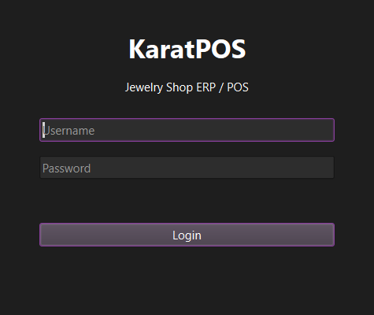

Type a username and password, then click **Login** (or press Enter).

The system comes with three ready-made accounts so you can explore every role immediately:

| Username | Password | Role | Can do |
|---|---|---|---|
| `admin` | `admin123` | **ADMIN** | Everything — gold rates, all reports, settings, user management, cancellations |
| `cashier` | `cashier123` | **CASHIER** | Selling, receipts, own transaction history, customers |
| `sales` | `sales123` | **SALES** | Browsing inventory, managing customers, logging repairs — cannot sell |

> **Important:** these are demo passwords. In a real shop, change them immediately (there is a prompt reminding you of this on first login) so no one outside your staff can access the system.

If you type the wrong password, the screen shows a red error message and lets you try again — it will never crash or close.

---

## 5. Understanding the Screen Layout

Every screen in KaratPOS shares the same layout, so once you learn it, you can find your way around anywhere:

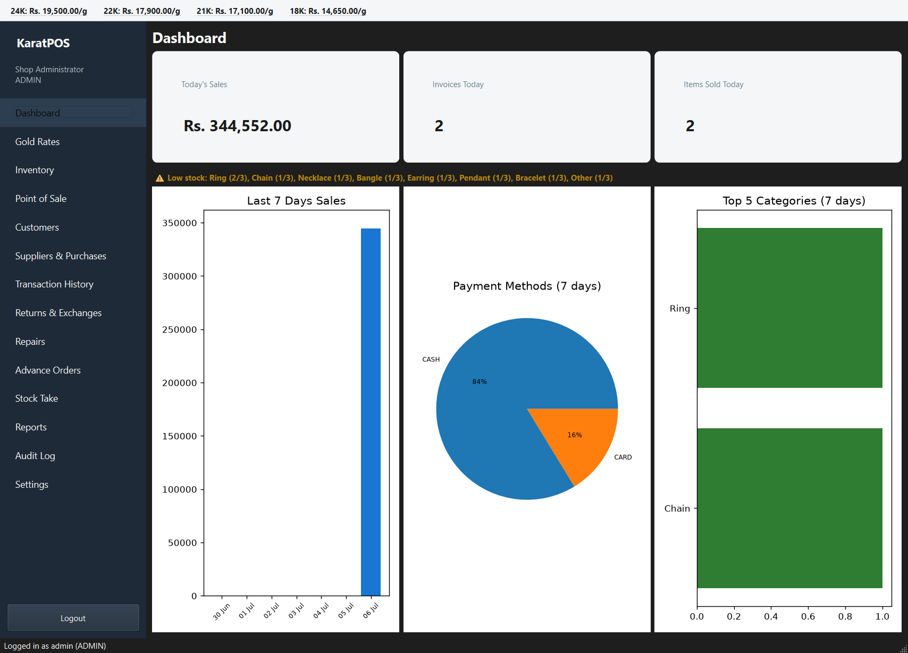

- **Top bar** (very top of the window): always shows **today's gold rate** for all four purities (24K, 22K, 21K, 18K). This is visible no matter which screen you're on, so you're never guessing what today's price is.
- **Left sidebar**: your menu. Click any item to switch screens. The sidebar **only shows the screens your role is allowed to use** — for example, a Cashier won't see "Gold Rates" or "Settings" in their list at all.
- **Main area** (center/right): the screen you're currently working on.
- **Logout button**: bottom of the sidebar. Always click this when you're done, especially on a shared shop computer.

---

## 6. The One Idea You Must Understand: Live Gold Pricing

This is the most important concept in the whole system, so read this section carefully even if you skip everything else.

**An item's selling price is never stored anywhere.** Instead, every time the system needs to show you a price — in Inventory, at the POS counter, anywhere — it calculates it **fresh, on the spot**, using this formula:

```
Item Price =  (net weight in grams  ×  today's gold rate for that purity)
            + making charge   (either a flat Rs. amount, or a % of the gold value)
            + stone value     (if the item has stones/gems)
```

Why does it work this way? Because gold rates change **every single day**, sometimes more than once a day. If prices were saved onto items, every item's saved price would become wrong the moment the gold rate moved. Instead, KaratPOS always uses **today's rate**, so prices are automatically correct without anyone having to manually update every item in stock.

### What this means for you in practice

- **Every morning**, an Admin must enter that day's gold rate for each purity (see [Gold Rates](#92-gold-rates)). This takes under a minute.
- If today's rate hasn't been entered yet, the system will show a warning and (if your Admin has turned on that setting) can even **block sales entirely** until the rate is entered — this protects the shop from accidentally selling gold at yesterday's (wrong) price.
- **Once a sale is completed**, the receipt "freezes" the exact numbers used at that moment (the rate, the weight, the making charge). If you look at that old invoice a year later, it will always show the original numbers — it will never recalculate using today's (different) rate. This is what makes your sales history reliable for accounting.

---

## 7. Your Daily Opening Routine

Every morning before selling anything, an Admin should:

1. Log in as `admin` (or another ADMIN account).
2. Go to **Gold Rates** in the sidebar.
3. Enter today's rate for each of the four purities (24K, 22K, 21K, 18K).
4. Confirm the top bar now shows today's date's rates (no more "using rate from [old date]" warning).

That's it — the whole shop can now sell items at correct, up-to-date prices all day.

---

## 8. Walkthrough: Making Your First Sale

This section walks through a complete sale from start to finish, exactly as a cashier would do it.

**Step 1 — Log in** as `cashier` / `cashier123`, then click **Point of Sale** in the sidebar.

**Step 2 — Add an item to the cart.** You have three ways to do this:
- **Type the item code** (e.g. `ITM-000001`) into the box at the top and press Enter.
- **Scan with a USB barcode scanner** — just point and scan; it types the code automatically, exactly like a keyboard, and presses Enter for you.
- **Click "Scan with Webcam"** — this opens your camera in a small window; hold up the item's printed QR tag and it detects it automatically.

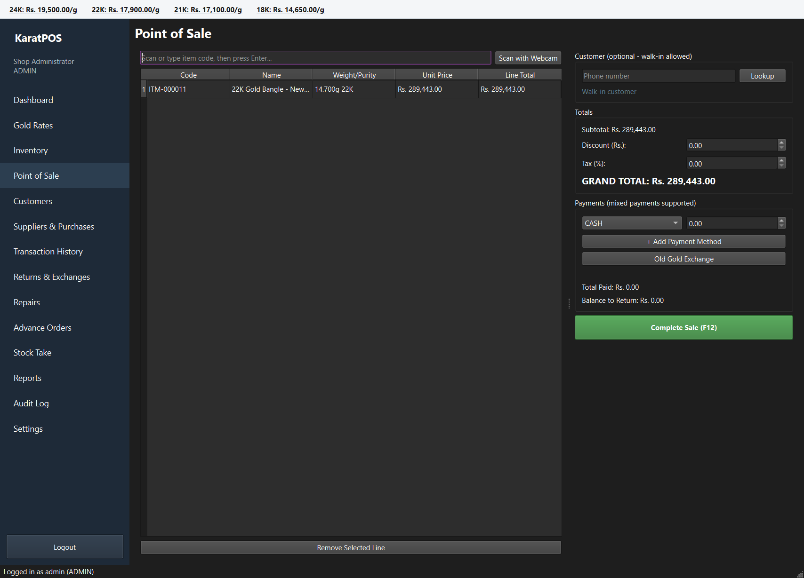

The moment an item is added to the cart, it is marked **RESERVED** in the system — this stops another cashier (if your shop has more than one till) from accidentally selling the same physical item twice while it's sitting on your counter.

**Step 3 — (Optional) Look up the customer.** Type their phone number in the box on the right and click **Lookup**. If they're not found, you can leave it as a walk-in sale — a customer is never required.

**Step 4 — Apply a discount, if any.** Type a Rs. amount into the Discount box. If the discount is large (above a threshold your Admin sets, by default 10%), the system will ask an Admin to type their username/password to approve it before the sale can continue — this stops staff from giving away large unauthorized discounts.

**Step 5 — Enter payment.** Choose a payment method (Cash, Card, Bank Transfer, Mobile) and type the amount received. You can click **"+ Add Payment Method"** to split a single sale across more than one method — for example, part cash and part card. If the customer is also trading in old gold, click **Old Gold Exchange** to record that separately (see the description under [Point of Sale](#94-point-of-sale) below); its value is added automatically as one of the payment lines.

**Step 6 — Click "Complete Sale."** The system will:
1. Save the invoice permanently (this cannot be undone by a crash — it's a single all-or-nothing database operation).
2. Mark the item(s) as **SOLD**.
3. Automatically generate a PDF receipt.
4. Show you the invoice number and any change due.

That's a complete sale, start to finish.

---

## 9. Screen-by-Screen Reference

### 9.1 Dashboard


Your homepage after login. Shows, at a glance:
- **Today's Sales** total in Rs.
- **Invoices Today** (how many separate sales)
- **Items Sold Today**
- A **low-stock warning banner** (yellow) if any item category has fewer AVAILABLE pieces than your Admin's configured minimum
- **Last 7 Days Sales** — a bar chart, one bar per day
- **Payment Methods** — a pie chart showing what portion of recent sales were cash vs. card vs. other methods
- **Top 5 Categories** — which item categories (Rings, Chains, etc.) are selling best

Everything on this screen updates the instant a new sale is completed anywhere in the system — you never need to manually refresh it.

### 9.2 Gold Rates

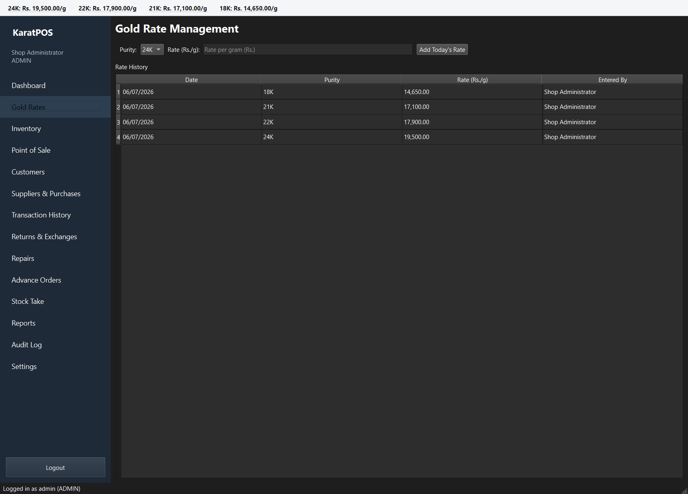

**Who can use this:** ADMIN only.

This is where the day's gold price is entered. Pick a purity from the dropdown, type the rate per gram, and click to save. Every rate ever entered stays permanently in the history table below — rates are **never edited or deleted**, only added, so there is always an honest record of what the shop charged on any given day in the past.

### 9.3 Inventory

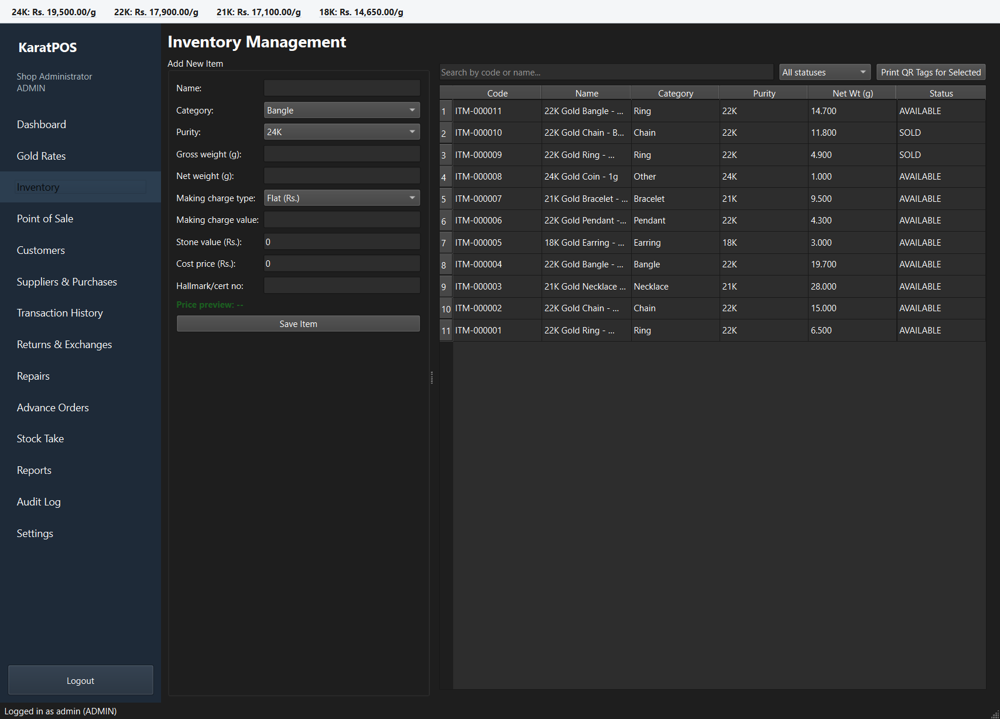

**Who can use this:** ADMIN, SALES.

This is where new jewelry items are added to stock and existing stock is searched. When adding an item you'll notice a **live price preview** at the bottom of the form — as you type the weight, purity, and making charge, the price updates immediately using today's gold rate, so you can see exactly what the customer would pay before you even save the item.

Other things you can do here:
- **Search/filter** existing stock by code, name, category, purity, or status.
- **Print QR Tags for Selected** — generates a small printable sticker (QR code + item code + weight + purity) that you stick onto the physical item. Later, scanning that sticker at the POS instantly pulls up the item.

### 9.4 Point of Sale


**Who can use this:** ADMIN, CASHIER.

The main selling screen — see the full walkthrough in [Section 8](#8-walkthrough-making-your-first-sale) above. A few extra details:

- **Old Gold Exchange**: click this button when a customer wants to trade in old jewelry as part of a purchase. You enter its weight and assessed purity; the system suggests a buy-back rate (today's rate minus a small margin your Admin configures) which you can adjust. The value is automatically applied as a credit toward the new purchase.
- Removing an item from the cart (select it, click **"Remove Selected Line"**) immediately releases its RESERVED lock, making it available for sale again elsewhere.
- If you close the app with items still sitting in an unfinished cart, don't worry — the next time the app starts, it automatically releases those items back to available stock.

### 9.5 Customers

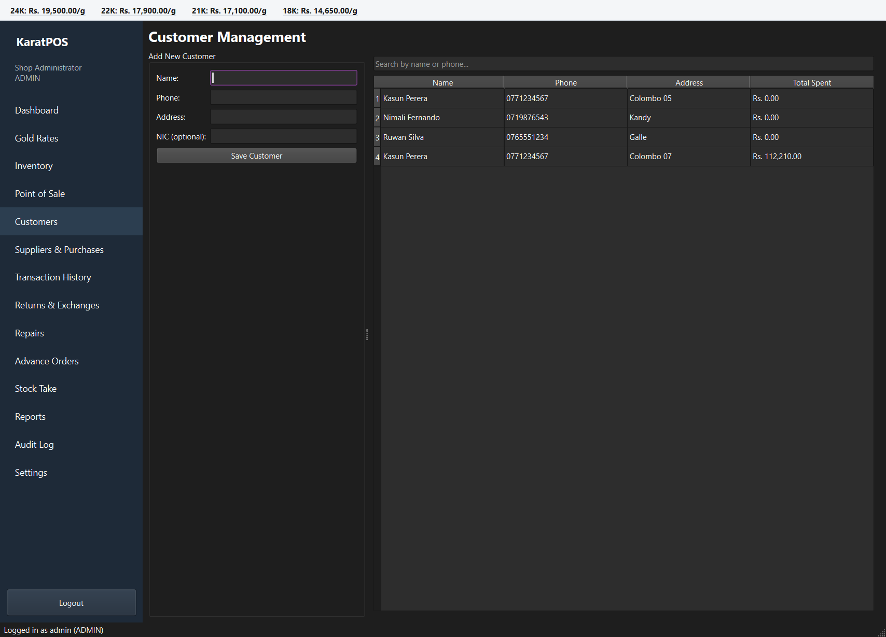

**Who can use this:** ADMIN, CASHIER, SALES.

A simple contact book: add a customer's name, phone number, and address. Once added, their phone number can be used to look them up instantly at the POS counter, in Repairs, or in Advance Orders — you only ever type their details once.

### 9.6 Suppliers & Purchases

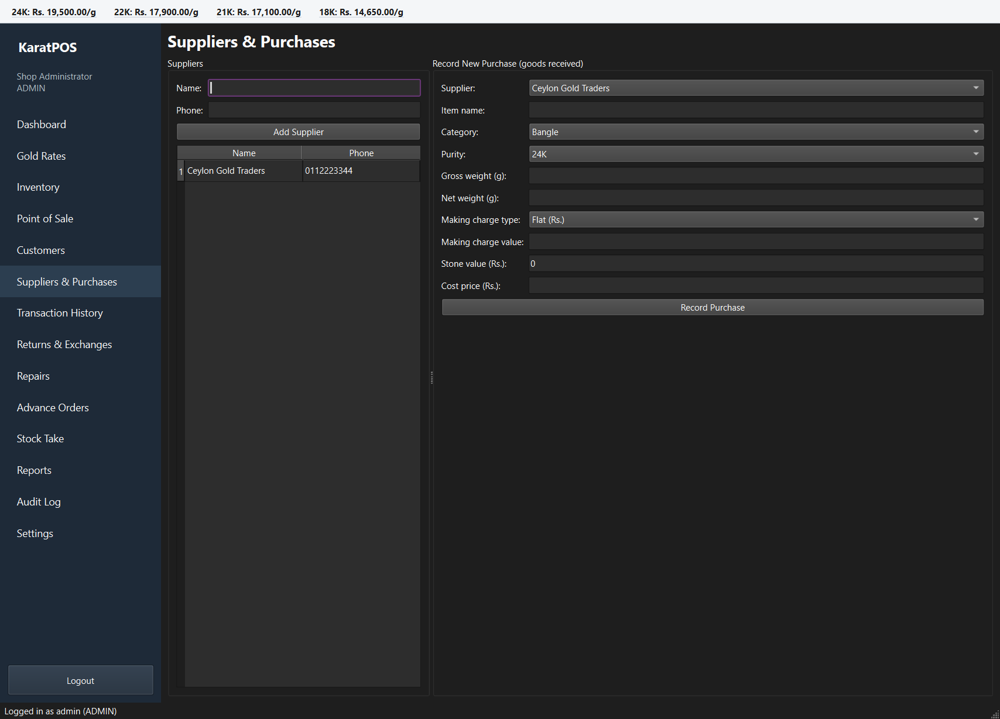

**Who can use this:** ADMIN only.

Two things happen here:
1. **Add suppliers** — the people/companies you buy raw gold or finished items from.
2. **Record a purchase** — when new stock physically arrives at your shop, fill in its details (weight, purity, making charge, and what you paid for it) and click **Record Purchase**. This immediately creates that item in your Inventory as `AVAILABLE`, and offers to print its QR tag right away — so a shipment of new stock can go from "just arrived" to "tagged and ready to sell" in one screen.

### 9.7 Transaction History

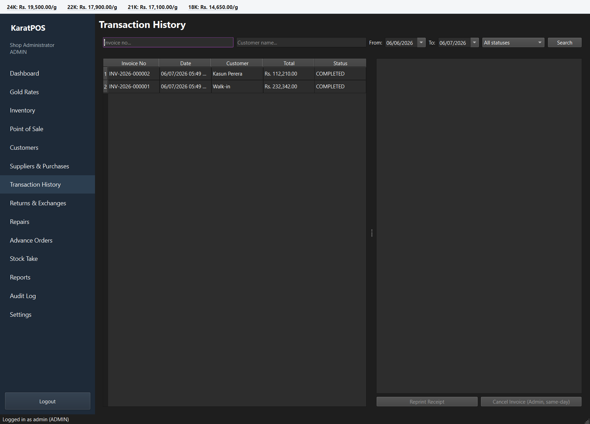

**Who can use this:** ADMIN, CASHIER.

A searchable list of every sale ever made. You can filter by invoice number, date range, customer, or cashier. Click any invoice to see its full details exactly as they were at the time of sale — the **frozen** numbers described in Section 6, not recalculated with today's rate.

From here you can also:
- **Reprint** a receipt (it will be watermarked "REPRINT" so it's never confused with the original).
- **Cancel an invoice** (ADMIN only, and only on the same day it was made) — this reverses the sale completely, putting the item(s) back into stock, and requires typing a reason.

### 9.8 Returns & Exchanges

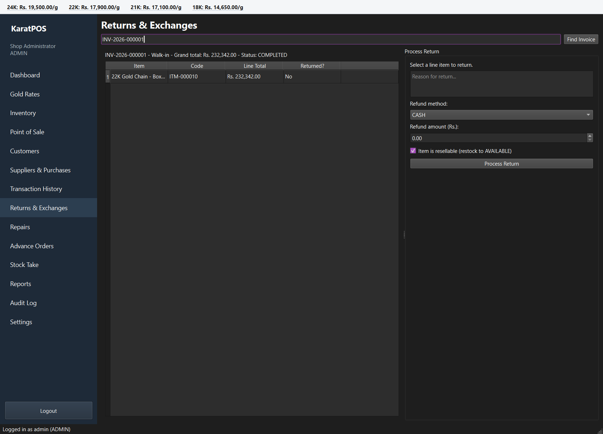

**Who can use this:** ADMIN, CASHIER.

Use this when a customer brings an item back. Steps:

1. Type the original invoice number and click **Find Invoice**.
2. Select which line item is being returned (an invoice can have several items; you can return just one).
3. Type a reason, choose whether the item is resellable (goes back to stock) or not (goes to scrap), and confirm the refund amount.
4. Click **Process Return**.

**Starting an exchange:** right after processing a return, the system will ask *"Start a new sale with the refund applied as store credit?"* If you say yes, it automatically switches you to the Point of Sale screen with that exact refund amount already filled in as a payment line (labeled **STORE_CREDIT**). You then just add the new item(s) the customer is exchanging into — if the new item costs more, they pay the difference in cash/card; if it costs less, the system automatically works out their change.

### 9.9 Repairs

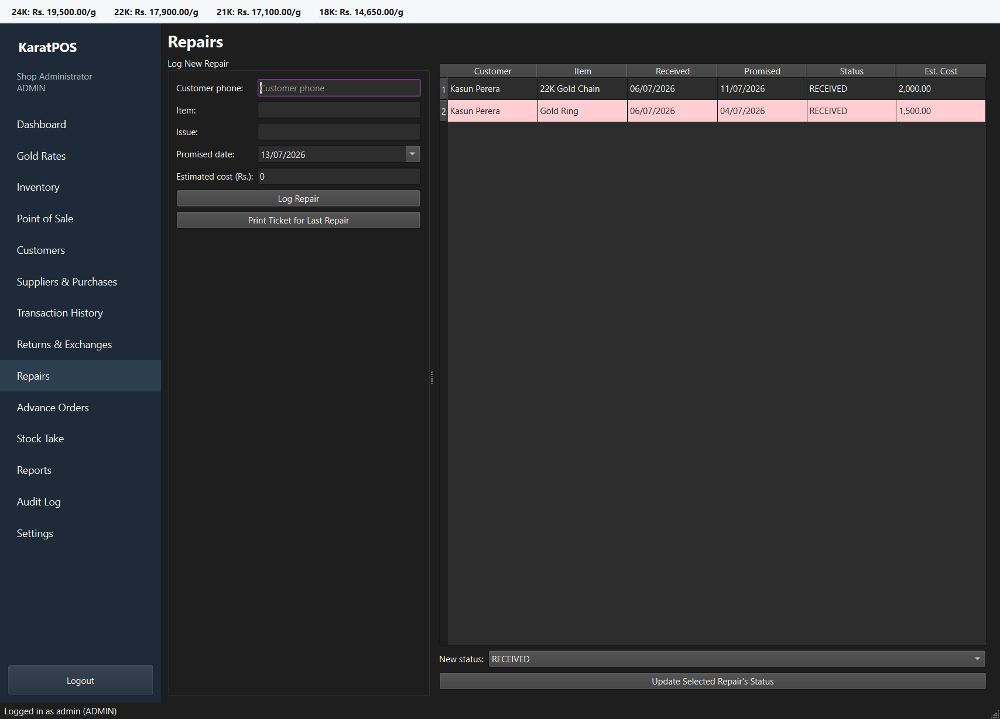

**Who can use this:** ADMIN, SALES.

Log a repair job: pick the customer (by phone number), describe the item and the issue, and set a promised delivery date. Each repair gets a job number and can be printed as a small ticket for the customer to keep.

As the job progresses, update its status: `RECEIVED` → `IN_PROGRESS` → `READY` → `DELIVERED`. Any repair whose promised date has passed and isn't yet `DELIVERED` is automatically highlighted in red/pink in the list, so overdue jobs are impossible to miss.

### 9.10 Advance Orders

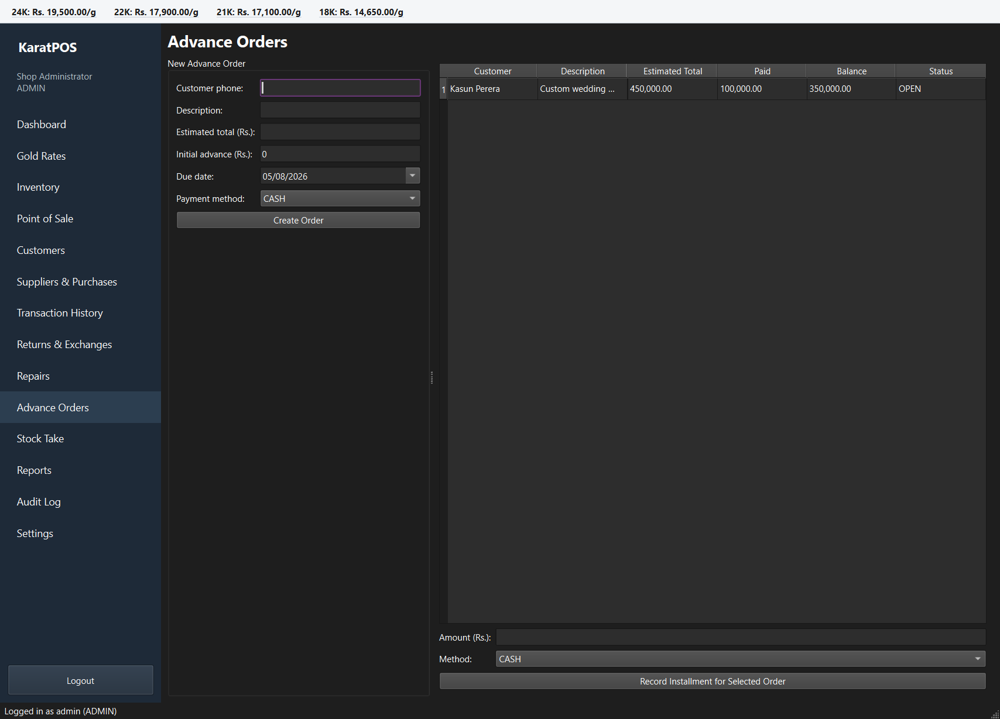

**Who can use this:** ADMIN, CASHIER.

For custom orders where a customer pays in installments — for example, a made-to-order wedding necklace. Create the order with an estimated total price and an initial deposit; the system tracks the remaining balance. Each time the customer pays another installment, record it here — the order automatically marks itself **FULFILLED** once the full balance has been paid.

### 9.11 Stock Take

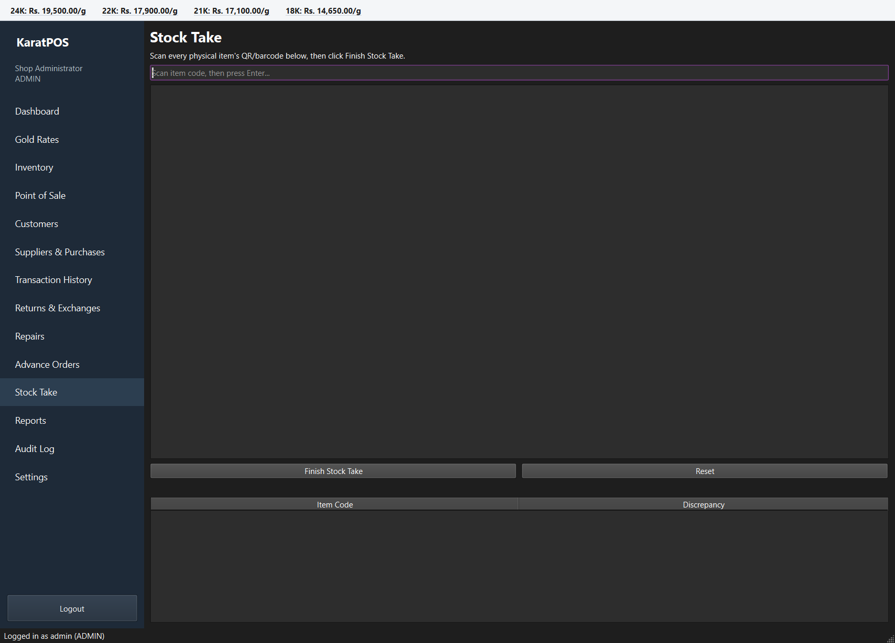

**Who can use this:** ADMIN, SALES.

Used for a physical stock count — walking around the shop scanning every item that's supposed to be in stock. Scan (or type) every item's code into the box; each one appears in the list as you go. When finished, click **Finish Stock Take**, and the system compares what you scanned against what it expects to be `AVAILABLE`, showing you:
- **Missing** items — expected in stock, but never scanned (possible theft, misplacement, or a data error worth investigating).
- **Unexpected** items — scanned, but the system doesn't think they should be available (e.g. already marked as sold).

### 9.12 Reports & Analytics

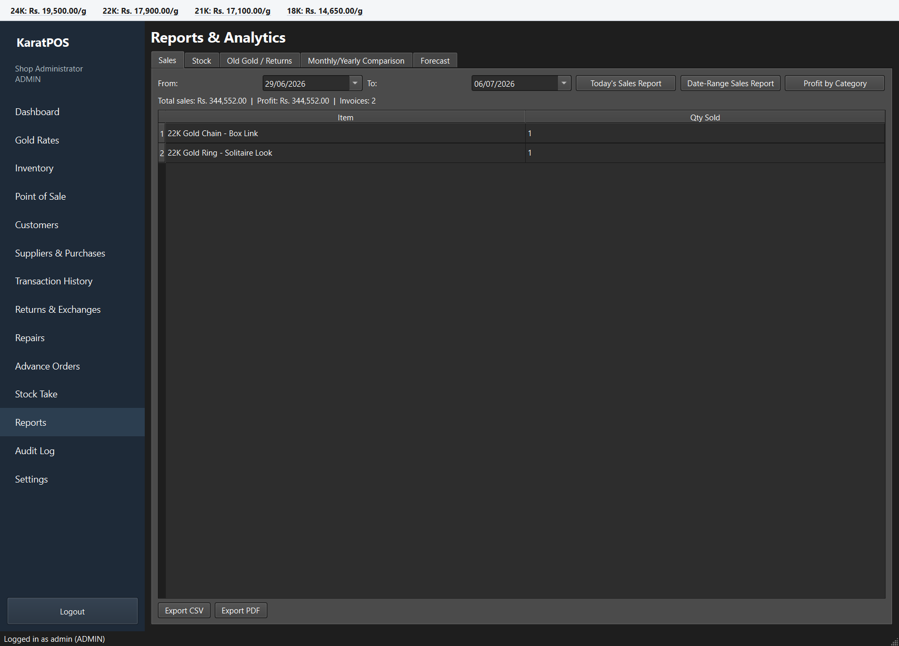

**Who can use this:** ADMIN only.

A tabbed screen covering everything a shop owner needs to understand their business:

- **Sales tab**: today's sales report (with profit and best-sellers), or a report over any date range you choose, plus profit broken down by category.
- **Stock tab**: total value of everything currently in stock (calculated at *today's* gold rate, so this number changes as rates change), and a list of "slow-moving" items that have sat unsold for 90+ days.
- **Old Gold / Returns tab**: reports on old gold bought back from customers, and on processed returns.
- **Monthly/Yearly Comparison tab**: a bar chart comparing total sales month-by-month over the last year, or year-by-year over the last five years — useful for spotting seasonal trends or long-term growth.

  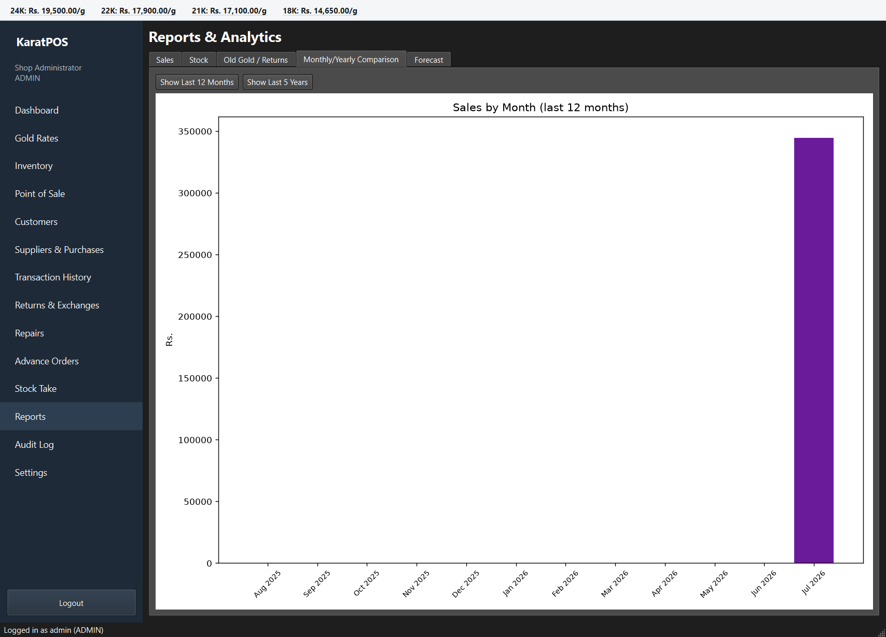

- **Forecast tab**: a simple 30-day sales prediction based on your recent trend.

  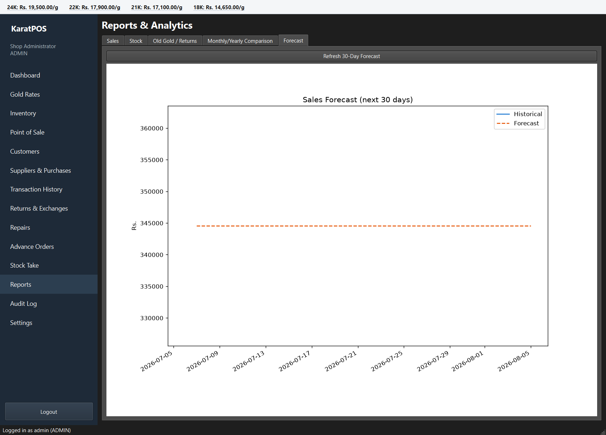

Every report can be exported as a CSV file (to open in Excel) or a PDF (to print or archive).

### 9.13 Audit Log

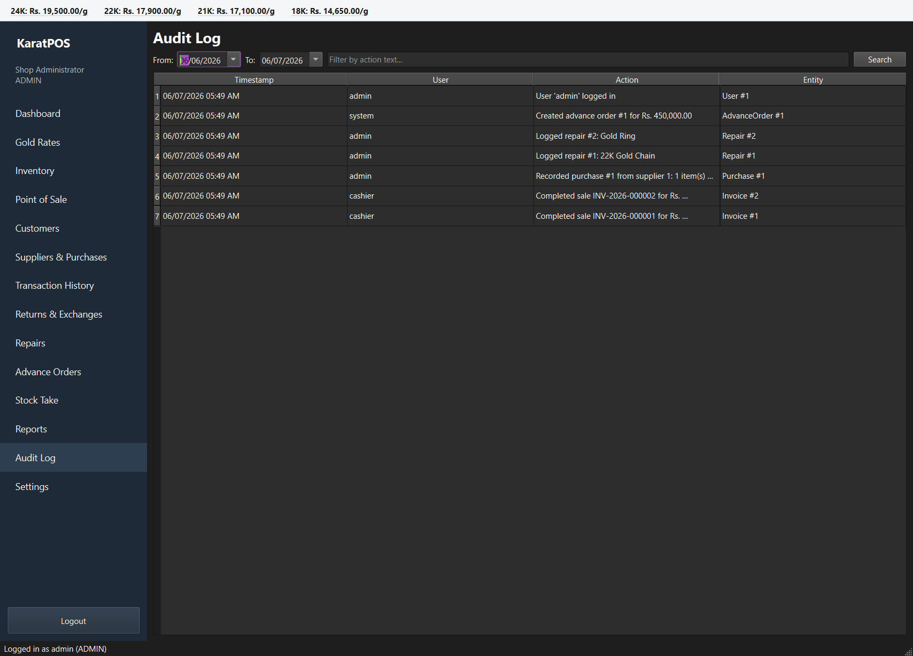

**Who can use this:** ADMIN only.

A complete, unchangeable record of every significant action taken in the system — who logged in, who entered a gold rate, who completed a sale, who cancelled an invoice, and so on, each with a timestamp. Filter by date range or search by keyword. This exists so that if something unexpected happens (a discrepancy, a dispute), there is always a clear trail of exactly who did what and when.

### 9.14 Settings

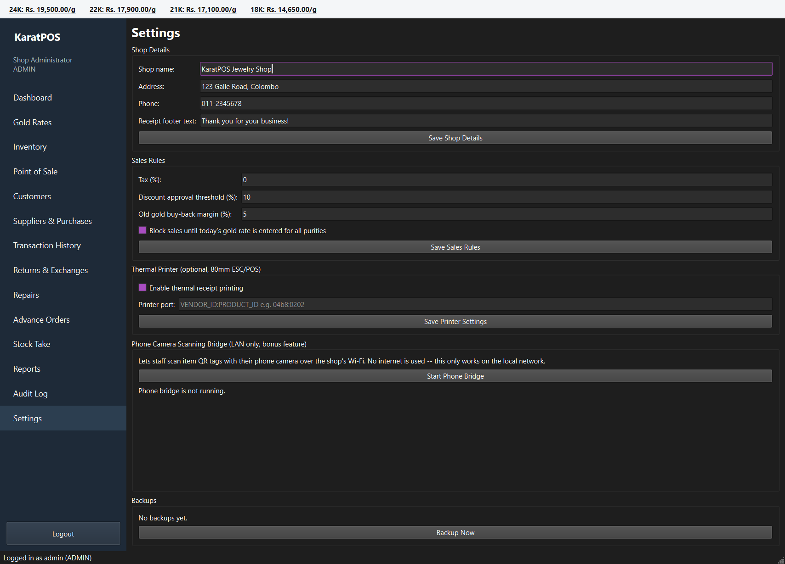

**Who can use this:** ADMIN only.

Shop-wide configuration, organized into sections:

- **Shop Details**: your shop's name, address, phone number, and the footer text printed on every receipt.
- **Sales Rules**: the tax percentage applied to sales, the discount percentage that requires admin approval, the margin subtracted from today's rate when buying back old gold, and a toggle to **block all sales** if today's gold rate hasn't been entered yet.
- **Thermal Printer**: turn on receipt printing to a small 80mm thermal printer (optional — most shops can skip this and just use the standard PDF receipt).
- **Phone Camera Scanning Bridge**: an optional feature letting staff scan QR tags using their own phone's camera instead of a webcam plugged into the till. Click **Start Phone Bridge**, then scan the QR code shown on screen with any phone connected to the same shop Wi-Fi — it opens a scanner page in the phone's browser with no app install needed, and no internet connection required (only the shop's local Wi-Fi).
- **Backups**: click **Backup Now** at any time to save a safety copy of your entire database. The system also does this automatically, once per day, the first time the app is opened that day, and keeps the most recent 30 days of backups.

---

## 10. Who Can Do What (Roles)

| | ADMIN | CASHIER | SALES |
|---|:---:|:---:|:---:|
| Dashboard | ✅ | ✅ | ✅ |
| Gold Rates | ✅ | ❌ | ❌ |
| Inventory | ✅ | ❌ | ✅ |
| Point of Sale | ✅ | ✅ | ❌ |
| Customers | ✅ | ✅ | ✅ |
| Suppliers & Purchases | ✅ | ❌ | ❌ |
| Transaction History | ✅ | ✅ | ❌ |
| Returns & Exchanges | ✅ | ✅ | ❌ |
| Repairs | ✅ | ❌ | ✅ |
| Advance Orders | ✅ | ✅ | ❌ |
| Stock Take | ✅ | ❌ | ✅ |
| Reports & Analytics | ✅ | ❌ | ❌ |
| Audit Log | ✅ | ❌ | ❌ |
| Settings | ✅ | ❌ | ❌ |

If a screen doesn't appear in your sidebar, your account's role simply doesn't have access to it — this isn't a bug, it's by design, so staff only see what's relevant to their job.

---

## 11. Common Questions & Troubleshooting

**"The POS screen won't let me complete a sale — it says something about today's rate."**
An Admin needs to go to Gold Rates and enter today's rate for every purity. If your shop has turned on the "block sale without today's rate" setting, this is required before any sale can be completed.

**"I typed the wrong discount and now it's asking for an admin login."**
This is intentional — any discount above the configured threshold (10% by default) requires a real Admin account's username and password to approve, to stop unauthorized discounting. Ask your manager to type their credentials, or reduce the discount below the threshold.

**"I accidentally added the wrong item to the cart."**
Select that line in the cart table and click **Remove Selected Line** — this also releases the item back to available stock immediately.

**"The app crashed / the power went out mid-sale."**
No sale is ever partially saved — either the whole sale completes, or nothing happens at all. Just reopen the app; the item(s) that were sitting in the unfinished cart will automatically be released back to available stock the next time the app starts.

**"A customer wants to return one item from a multi-item invoice."**
Go to Returns & Exchanges, find the invoice, and select just that one line — the rest of the invoice is unaffected.

**"How do I get my sales data onto another computer?"**
Copy the `data` folder (found next to the installed program, or inside `jewelry_pos/data` if running from source) — it contains your entire database and all backups.

**"I forgot the admin password."**
There is no built-in password reset from the login screen (by design, for security). Contact whoever manages your system's database directly.

---

## 12. Keeping Your Data Safe

- KaratPOS automatically backs up your entire database once per day, the first time the app opens that day. The last 30 daily backups are always kept.
- You can also make a backup on demand any time from **Settings → Backups → Backup Now**.
- Backups are stored in the `data/backups` folder as dated files (e.g. `jewelry_pos_2026-07-06.db`). To restore one, close the app, replace the current database file with the desired backup file (renaming it back to the original database filename), and reopen the app.
- Nothing important is ever permanently deleted by the system — sales, customers, and inventory items are only ever "soft-deleted" (hidden from normal view) so that your historical records always stay intact for accounting purposes.

---

*This manual describes KaratPOS as built through all 10 development phases, including the Dashboard analytics charts, the Returns exchange flow, and monthly/yearly sales comparison — all shown in the real screenshots above.*
